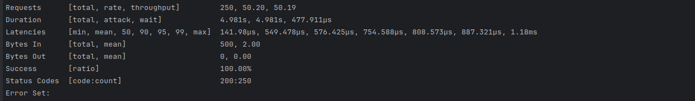

# <p style="text-align:center;">Json Parser Service (АПИ)</p>


---
- Это сервис (АПИ) позволяет вам обрабатывать json
- Сервис включает в себя возможность разделяемое состояние,
- поддерживает обработку аргументов командной строки,
- а также включает тщательное ведение логи и юнит тесты и метрики


----

## Тех стек


---

## Первые шаги

1. Создайте базу данных и таблицу в ней 

```postgresql

CREATE DATABASE order_service;

CREATE SCHEMA order_schema;

CREATE TABLE order_schema.orders (
    order_uid TEXT PRIMARY KEY,
    order_data TEXT NOT NULL
);

```

2. Запустите cервис, используя следующую команду:
   `cargo run -p <порт> -d <dsn>` 

 `по умолчанию порт сервис работает на порт 3000`

3. Теперь можете запустит тесты

```shell
 TEST_PORT=4000 cargo test
```

---

### Метрики

- В сервис были добавлены метрики который вам покажут если все работает как надо

- Чтобы посмотреть метрики перейти на `localhost:3000/metrics`

---
### Vegeta

- чтобы сделать нагуженное тестирование используйте следующую команду

     ```shell
   vegeta attack -duration=5s -rate=5 -targets=target.list 
  ```
  
- Результат тестирования health эндпойнты используя vegeta




---